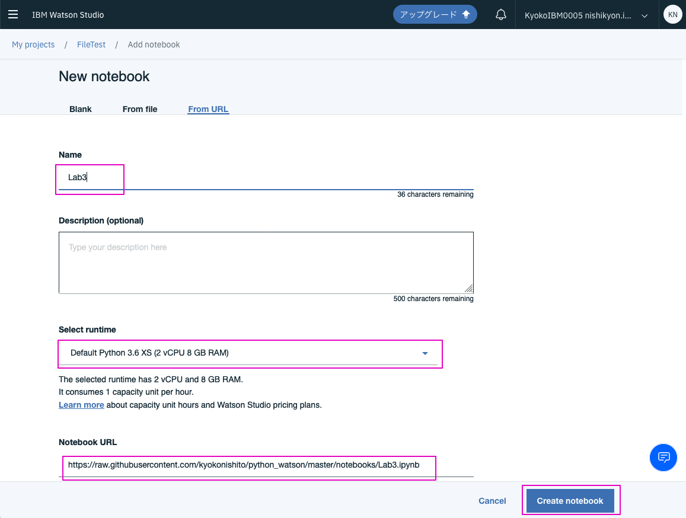

# python_watson
pythonからWatson APIを呼び出すサンプルです。

## ハンズオンの前提条件
[Watson Studio サービスとProjectの作成](https://qiita.com/nishikyon/private/ba698b638300848b746e)の以下が完了している必要があります：　
- Watson Studio サービスの作成
- Watson Studioの起動
- Projectの作成

## ハンズオンの流れ(全Lab共通)
1. IBM Cloud: サービスの作成
2. IBM Cloud: 作成したサービスの資格情報取得 
　     - API KEY(API鍵)とURL

3. Watson Studio: githubのファイルからnotebookの作成
4. Watson Studio: notebookの指示にしたがってAPIを実行する 
　      - 2で取得したAPI KEYとURLを使用

## ハンズオン
Watson StudioでProjectの画面を表示してください。
Lab１からLab3まで順に実施してください（4でLab情報を指定します）。
> Watson StudioでProjectの画面表示ができていない場合は[Watson Studio サービスとProjectの作成](https://qiita.com/nishikyon/private/ba698b638300848b746e#4-おまけログイン後作成済projectの表示方法)を参照して表示せてください。

### 1. 上のメニューから`Add to project`をクリックします。 

### 2.  表示された`Choose asset type`から`Notebook`をクリックします。 

### 3.  表示された`New notebook`から`From URL`をクリックします。 

### 4. Labの内容の指定
`Name` と `Notebook URL`にそれぞれ以下の値をハンズオンするLabに応じてコピペします。 

#### Lab1: Language Translator 翻訳
Name: `Lab1`  
Notebook URL: `https://raw.githubusercontent.com/kyokonishito/python_watson/master/notebooks/Lab1.ipynb`

#### Lab2: Natural Language Understanding 自然言語解析
Name: `Lab2` 
Notebook URL: `https://raw.githubusercontent.com/kyokonishito/python_watson/master/notebooks/Lab2.ipynb`

#### Lab3: Visual Recognition 画像認識
Name: `Lab3` 
Notebook URL: `https://raw.githubusercontent.com/kyokonishito/python_watson/master/notebooks/Lab3.ipynb`

### 5. runtimeの指定とNotebookの作成
`Select runtime`に`python3`が入っているもの(python3.6など)を選択して(通常はデフォルト値のままでよい)、`Create Notebook`をクリック 

### 6. Notebookの実行
Notebookが開きますので、ロードされたNotebookの指示にしたがってハンズオンを進めてください。

### 7. 完了
全て終わったら、右上のSaveアイコンをクリックし、次に右上に表示されている現在のプロジェクトの名の文字をクリックしてプロジェクトの画面に戻ってください。 

### 8. 次のLabの実行
次のLabがあれば[1に戻って](#HandsOn)再度Notebookを作成します。

>### Hint: 保存したNotebookを呼び出すには?
>Projectの画面で`Assets`タブをクリックして表示されたページの、`Notebook`の見出しの下にこれまで作成したNotebooｋのリストが表示されています。呼び出したいNotebooｋの名前をクリックするとそのNotebooｋが開きます。 
実行や編集したい場合は、Notebookが開いた後、上部にある鉛筆アイコンをクリックして、`Edit Mode`にしてください。あるいは`Notebook`のList上で鉛筆アイコンを直接クリックしてください。 
>
>

## オプションハンズオン
(下記はModel Biulder機能が廃止になったため実施不可です。更新予定です。) 
余力があればWatson APIではありませんがWatson Studioつながりで、Watson Machine Learningにも触れてみましょう。コーディングなしで機械学習モデルが作成できます。
2019年6月5日に開催したDeveloper Dojo Shibuyaでのハンズオン資料です：
### [Watson Studioで機械学習ハンズオン](https://speakerdeck.com/kyokonishito/ml-handson-with-watson-studio)

